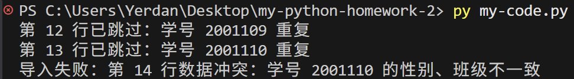
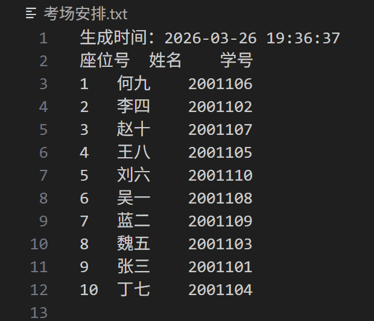
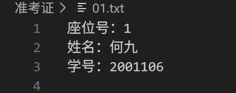

# 冯嘉晔-25361024-第二次人工智能编程作业

本项目实现了一个命令行考务系统，围绕学生名单导入、随机点名、考场排座和准考证生成等任务展开，并记录了 AI 协作、调试修复和人工代码审查过程。

## 目录

- [一、项目概述](#一项目概述)
- [二、任务拆解与 AI 协作策略](#二任务拆解与-ai-协作策略)
- [三、核心 Prompt 迭代记录](#三核心-prompt-迭代记录)
- [四、Debug 与异常处理记录](#四debug-与异常处理记录)
- [五、人工代码审查](#五人工代码审查含逐行中文注释)
- [六、验收结果](#六验收结果)
- [七、工程规范补充](#七工程规范补充)
- [八、个人复盘](#八个人复盘)

## 一、项目概述

### 核心功能

1. 通过学号查找学生信息
2. 随机点名
3. 随机生成考场座位并导出考场安排文件
4. 按座位信息批量生成准考证文件

### 项目文件

- 主程序：`my-code.py`
- 输入数据：`人工智能编程语言学生名单.txt`
- 输出文件：`考场安排.txt`、`准考证/*.txt`

## 二、任务拆解与 AI 协作策略

为了避免“一次性让 AI 生成全部代码导致难以调试”，我采用了分阶段协作方式，使需求分析、实现、修复和验收逐步推进。

### 阶段 1：需求建模与边界定义

- 先让 AI 将需求拆成对象和功能模块，包括 `Student` 类、`ExamSystem` 类和主菜单流程。
- 明确输入输出边界：输入为学生名单文本，输出为 `考场安排.txt` 和 `准考证/*.txt`。
- 提前定义异常场景，包括空文件、格式错误、学号不合法和人数越界。

### 阶段 2：最小可运行版本

- 先完成主链路：加载名单 -> 生成座位 -> 导出文件。
- 验证程序能够在命令行中循环运行，并保证菜单分支可达。

### 阶段 3：工程化完善

- 补充输入校验，例如 `validate_student_id` 和人数必须为整数。
- 补充异常处理，例如 `FileNotFoundError`、`ValueError`、`EOFError` 和 `KeyboardInterrupt`。
- 优化函数职责，将解析、查找、随机抽样和落盘输出分别封装。

### 阶段 4：结果验收与回归

- 验证文件生成数量与学生人数一致。
- 检查文本编码为 UTF-8，确保中文输出正常。
- 对关键分支做回归验证，包括无效菜单输入、超范围点名和空名单场景。

## 三、核心 Prompt 迭代记录

这一部分记录的不是“我一次性把需求丢给 AI”，而是我如何先整理需求，再让 AI 帮我拆解实现步骤，最后按顺序完成整个程序。

### 第一步：先把老师要求整理成 Markdown

我先把老师给的任务整理成更清晰的 Markdown 结构，把功能、输入输出和约束条件写明，这样 AI 更容易准确理解需求边界，而不是直接生成一大段难以修改的代码。

```md
# 作业要求

## 任务背景
- 使用 Python 高级特性完成“学生信息与考场管理系统”
- 作业重点不仅是实现功能，还要体现任务拆解、AI 协作、代码审查和工程规范

## 系统功能
1. 程序启动时读取学生名单文本文件
2. 按学号查询学生完整信息，不存在时给出友好提示
3. 随机点名，人数不能超过总人数，并处理非数字输入异常
4. 生成 `考场安排.txt`，包含座位号、姓名、学号和生成时间
5. 生成 `准考证` 文件夹及 `01.txt`、`02.txt` 等独立准考证文件

## 输入输出
- 输入：学生名单文本文件
- 输出：`考场安排.txt` 和 `准考证/*.txt`

## 关键规范
- 必须使用面向对象方式，定义 `Student` 和 `ExamSystem` 两个类
- `Student` 需要包含 `__init__` 和 `__str__`
- 至少包含一个 `@staticmethod` 或 `@classmethod`
- 只允许使用标准库，不使用第三方库
- 必须使用 `try-except` 处理 `FileNotFoundError`、`ValueError` 等异常
- AI 生成的核心代码旁需要补充自己手写的逐行中文注释
```

### 第二步：把 Markdown 需求发给 AI，请它拆分模块

在把需求整理成 Markdown 后，我没有直接让 AI 写完整程序，而是先让它根据这份需求进行任务拆解，告诉我应该先做哪些模块、后做哪些模块，并为每一步生成对应的提示词。

我给 AI 的提问方式是：

> 请根据上面的 Markdown 要求，把这个程序拆解成若干个可以逐步实现的小模块，并说明推荐的实现顺序；同时为每个模块分别给出一个可以直接继续提问的 Prompt。

AI 拆解后，我再按照它给出的顺序逐步实现，而不是一次性生成全部代码。

### 第三步：补充统一约束 Prompt

在正式分模块实现前，我又补充了一次约束，明确程序必须符合课程要求，避免 AI 生成超出作业范围的写法。

> 请用面向对象方式实现。要求：
> 1. 必须拆分为 `Student` 与 `ExamSystem` 两个类；
> 2. 只使用课程已学过的标准库：`random`、`os`、`datetime`；
> 3. 必须处理 `FileNotFoundError` 和 `ValueError`；
> 4. 菜单输入要做合法性校验；
> 5. 生成考场安排与准考证时使用 UTF-8 编码；
> 6. 每个函数职责单一，不要把所有逻辑写在 `main` 里。

### 第四步：按顺序发送模块 Prompt，逐步完成程序

根据 AI 的拆解结果，我按顺序继续提问，让它先完成基础模块，再补充菜单、异常处理和文件输出。整个过程不是“一个 Prompt 生成全部代码”，而是“一个 Prompt 只解决一个阶段的问题”。

实现顺序大致如下：

1. 先实现 `Student` 类，以及学生名单的读取与解析。
2. 再实现 `ExamSystem` 类中的查询功能和基础数据管理。
3. 然后实现随机点名与考场安排功能。
4. 最后实现准考证生成、菜单循环、输入校验和异常处理。

这种做法的好处是：

- 每一步的目标更明确，AI 更不容易漏掉细节。
- 如果某一部分出错，可以只修改对应模块，不需要推翻整份代码。
- 最终得到的程序结构更清晰，也更符合课程作业对规范性的要求。

## 四、Debug 与异常处理记录 

### 问题 1：准考证目录复用后残留历史文件 

**现象**

- 生成准考证时直接复用 `准考证/` 目录，并写入新的 `01.txt`、`02.txt` 等文件。
- 如果上一次生成了 30 份、本次只生成 10 份，那么 `11.txt` 到 `30.txt` 会继续留在目录中，容易让人误以为也是本次结果。

**定位**

- 问题出在 `generate_admission_tickets()`。
- 代码只调用了 `os.makedirs(folder_name, exist_ok=True)` 创建或复用目录，但在写新文件前没有清理旧的 `.txt` 文件。
- 这属于典型的“输出目录复用导致脏数据残留”问题。

**修复**

- 新增 `clear_admission_ticket_files(folder_name)`，在生成准考证前先扫描目标目录。
- 只删除目录内已有的 `.txt` 文件，再写入本次新的准考证，避免误删其他非准考证文件。

**验证**

- 用临时目录模拟“上次 30 人、本次 2 人”的场景。
- 验证结果表明：旧的 `11.txt` 到 `30.txt` 会被清理，本次只保留重新生成的 `01.txt` 和 `02.txt`。

### 问题 2：学生名单没有校验重复学号 

**现象**

- 原程序只检查学号是否为数字，没有检查学号是否唯一。
- 一旦名单中存在重复学号，同一个学生可能被随机点名两次、排入两个座位；按学号查找时又只会返回第一条记录，导致问题被掩盖。

**定位**

- 问题集中在 `load_students()` 的加载流程。
- 每一行只要格式合法、学号是数字，就会直接加入 `self.students`。
- 由于没有“已出现学号集合”，重复记录会被当作独立学生参与后续全部流程。

**修复**

- 在加载名单时维护以学号为键的去重结构，并记录重复学号。
- 若发现学号重复，则跳过重复记录，并在加载结束后打印重复学号提示，避免脏数据静默进入系统。

**验证**

- 用包含重复学号的临时名单文件进行测试。
- 结果显示程序会提示重复学号，并且最终只加载唯一学号对应的学生记录，后续随机点名和考场排座都基于去重后的数据执行。

## 五、人工代码审查（含逐行中文注释）

下面选取“准考证生成”相关逻辑作为人工审查对象。这个片段既包含输出文件生成，也包含目录复用时的清理逻辑，比较能体现程序的工程性。

```python
def clear_admission_ticket_files(folder_name):
    # 文件夹不存在时直接返回，不做任何处理。
    if not os.path.isdir(folder_name):
        return

    # 只删除旧的准考证文本，保留目录中的其他文件。
    for entry in os.scandir(folder_name):
        if entry.is_file() and entry.name.lower().endswith(".txt"):
            os.remove(entry.path)


def generate_admission_tickets(self, folder_name="准考证"):
    if not self.exam_arrangement:
        raise ValueError("暂无考场安排可生成准考证")

    os.makedirs(folder_name, exist_ok=True)
    # 先删除旧文件，保证目录里只保留本次生成的准考证。
    clear_admission_ticket_files(folder_name)

    for seat_number, student in self.exam_arrangement:
        file_path = os.path.join(folder_name, f"{seat_number:02d}.txt")

        with open(file_path, "w", encoding="utf-8") as file:
            file.write(f"座位号：{seat_number}\n")
            file.write(f"姓名：{student.name}\n")
            file.write(f"学号：{student.student_id}\n")
```

### 我的理解要点

1. 这段代码体现了“先校验状态，再执行输出”的思路。只有已经生成考场座位表，程序才允许继续生成准考证，避免输出和业务状态不一致。
2. `clear_admission_ticket_files()` 的作用不是简单删除文件，而是解决目录复用时旧结果残留的问题，保证本次生成的数据是干净的。
3. 清理时只删除 `.txt` 文件，没有粗暴地删除整个文件夹，这样能降低误删其他文件的风险，说明代码考虑了安全性。
4. `os.path.join(folder_name, f"{seat_number:02d}.txt")` 直接按 `01.txt`、`02.txt` 这种格式生成文件路径，既便于排序检查，也让路径拼接保持统一。
5. `os.path.join()` 和 `encoding="utf-8"` 分别体现了路径处理规范和中文编码规范，说明代码不只是追求能运行，也考虑了可移植性和可验收性。
6. 从结构上看，清理旧文件和生成新准考证是分开的，这种拆分让每个函数职责更清晰，后续维护和测试也更方便。

## 六、验收结果

### 已实现功能

1. 学号查找：支持合法性校验与不存在提示。
2. 随机点名：支持数量输入校验和越界保护。
3. 考场安排：可导出 `考场安排.txt`。
4. 准考证生成：可批量生成到 `准考证/` 目录。

### 亮点

1. 名单导入过程更透明，遇到格式错误或无效数据时，会提示出错行号和原因。
2. 对学号重复做了更严格的校验，完全一致的记录才会被跳过；若学号相同但其他信息不一致，程序会立即报错并退出。
3. 导入结束后会输出“成功导入 X 条，跳过 Y 条”的汇总信息，方便快速检查数据质量。
4. 生成准考证前会先清理目录中的旧 `.txt` 文件，避免历史结果混入本次输出。

### 运行示例

图 1 展示了名单中出现学号冲突时，程序能够定位具体冲突行，并立即终止执行，避免错误数据继续进入后续流程。



图 2 展示了程序在正常数据下的运行结果，可以顺利完成考场安排或相关输出文件的生成。




### 输出文件

- `考场安排.txt`
- `准考证/01.txt` 到 `准考证/n.txt`

## 七、工程规范补充

为避免将本地运行产物误提交到远程仓库，已在 `.gitignore` 中增加以下内容：

- `准考证/`
- `考场安排.txt`

这样可以保证仓库主要保留源代码和说明文档。

## 八、个人复盘

本次作业最大的收获不是“让 AI 写代码”，而是“通过约束和验证驱动 AI 产出可维护代码”。

### 后续可继续改进的方向

1. 增加自动化测试，例如对 `parse_student_line` 和 `random_pick_students` 编写单元测试。
2. 将输出格式抽为配置项，减少硬编码。
3. 给异常信息增加“用户提示 + 开发调试信息”的双层结构，进一步提升可维护性。
